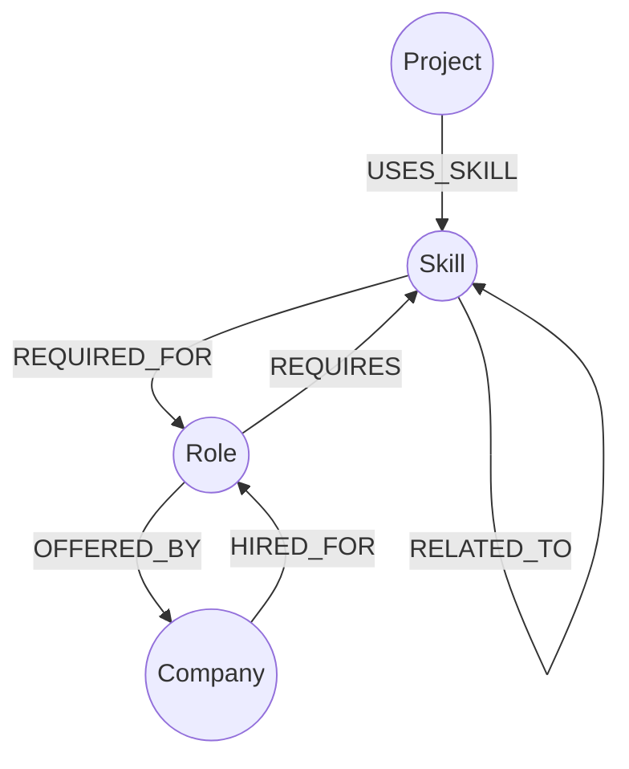

# CareerGraph

CareerGraph is a graph-powered career discovery and skill-matching platform built with Next.js, FastAPI, and CognoDB.

It helps users answer a practical career question:

> Given the skills I have, which career roles am I best prepared for, what skills am I missing, and how are those roles connected to companies and projects?

## Live Demo

**Frontend:** [https://careergraph-1-7pm4.onrender.com](https://careergraph-1-7pm4.onrender.com)

**Backend API:** [https://careergraph-urm6.onrender.com](https://careergraph-urm6.onrender.com)

**GitHub:** [https://github.com/zainam-decodes/careergraph](https://github.com/zainam-decodes/careergraph)

---

## Problem Statement

Career discovery is often presented as a flat list of jobs or skills. However, real career decisions involve relationships between skills, career roles, companies, projects, and technologies.

For example:

> "I know SQL and Machine Learning. What roles could I pursue, which skills am I missing, and which companies are associated with those roles?"

These relationships form a naturally connected data structure.

CareerGraph models those relationships as a graph instead of treating them as isolated records.

---

## Why a Graph Database?

CareerGraph uses CognoDB, a Neo4j-compatible graph database, because the application's core problem is relationship-heavy.

The main entities are:

* Skills
* Roles
* Companies
* Projects

These entities are connected through relationships such as:

`Skill → Role → Company`

and:

`Project → Skill → Role`

A graph database makes these relationships first-class and allows CareerGraph to perform multi-hop traversals using Cypher.

This makes questions such as the following natural to query:

* Which roles require a particular skill?
* Which companies are associated with a role?
* Which skills are missing for a target role?
* Which projects use skills required by a role?
* What entities are connected to a selected career path?

---

## Core Use Case

A user selects the skills they currently know.

For example:

* SQL
* Docker
* Machine Learning

CareerGraph compares those skills against the complete skill requirements of each role.

### Example: Data Scientist

Required skills:

* Python
* SQL
* Machine Learning
* Statistics
* Pandas
* Data Visualization

User skills:

* SQL
* Docker
* Machine Learning

Matched skills:

* SQL
* Machine Learning

Missing skills:

* Python
* Statistics
* Pandas
* Data Visualization

Match:

`2 / 6 × 100 = 33%`

The application therefore displays a 33% match rather than incorrectly treating the user's three selected skills as the denominator.

---

## Features

### Explore

Search and explore:

* Skills
* Roles
* Companies
* Projects

### Career Matching

Users can select their skills and receive ranked career-role recommendations.

Each match provides:

* Match percentage
* Matched skills
* Missing skills
* Connected companies
* Career path exploration

### Interactive Graph

Users can visualize relationships between skills, roles, companies, and projects.

### Skill Exploration

Users can explore individual skills and discover the roles and entities connected to them.

### UX States

The application includes:

* Loading states
* Skeleton loaders
* Empty states
* Error states
* Retry actions
* No-skill-selected states
* No-match states
* Responsive layouts
* Light/dark mode

---

## Architecture

```text
User
  |
  v
Next.js / React Frontend
  |
  | REST API
  v
FastAPI Backend
  |
  | Cypher Queries
  v
CognoDB Cloud
```

### Frontend

* Next.js
* React
* TypeScript
* Tailwind CSS
* Interactive graph visualization
* Dedicated API client

### Backend

* Python
* FastAPI
* Uvicorn
* Pydantic
* Official Neo4j Python Driver

### Database

* CognoDB Cloud
* Neo4j-compatible Cypher

### Deployment

* Render

---

## Data Model



### Node Types

| Node    | Purpose                           |
| ------- | --------------------------------- |
| Skill   | Technical skills and technologies |
| Role    | Career/job roles                  |
| Company | Companies associated with roles   |
| Project | Projects utilizing skills         |

### Relationships

| Relationship | Direction       | Purpose                              |
| ------------ | --------------- | ------------------------------------ |
| REQUIRES     | Role → Skill    | Defines skills required by a role    |
| REQUIRED_FOR | Skill → Role    | Reverse traversal from skill to role |
| OFFERED_BY   | Role → Company  | Associates roles with companies      |
| HIRED_FOR    | Company → Role  | Reverse company-to-role relationship |
| USES_SKILL   | Project → Skill | Connects projects with technologies  |
| RELATED_TO   | Skill ↔ Skill   | Represents related skills            |

---

## Dataset

The current CognoDB dataset contains:

* 70 total nodes
* 38 Skills
* 12 Roles
* 10 Companies
* 10 Projects
* Approximately 292 relationships

The seed script creates the graph data and relationships required by the application.

---

## Matching Algorithm

CareerGraph calculates match percentage using:

```text
Match Percentage =
(Matched Required Skills / Total Required Skills) × 100
```

For example:

```text
User Skills:
SQL
Docker
Machine Learning

Role:
Data Scientist

Required:
Python
SQL
Machine Learning
Statistics
Pandas
Data Visualization
```

Matched skills:

```text
SQL
Machine Learning
```

Total required skills:

```text
6
```

Therefore:

```text
2 / 6 × 100 = 33%
```

Missing skills:

```text
Python
Statistics
Pandas
Data Visualization
```

### Why this calculation?

The denominator represents the actual requirements of the role.

Using the number of user-selected skills as the denominator would produce misleading results. For example, adding unrelated skills should not reduce a user's qualification for a role.

---

## API

### Health

`GET /api/health`

Returns backend and database connectivity status.

### Explore

`GET /api/explore`

Returns CareerGraph entities for exploration and search.

### Skills

`GET /api/skills`

Returns available skills.

Optional parameters:

* `q`
* `category`

### Career Matches

`POST /api/matches`

Example request:

```json
{
  "skills": [
    "SQL",
    "Docker",
    "Machine Learning"
  ]
}
```

The endpoint returns ranked roles with:

* Match percentage
* Matching skills
* Missing skills
* Connected companies

### Graph

`GET /api/graph?entity=Data%20Scientist`

Returns the graph neighborhood surrounding the requested entity.

---

## Cypher Queries

The project contains dedicated Cypher query files.

### explore.cypher

Searches across Skills, Roles, Companies, and Projects.

### matches.cypher

Retrieves the complete set of skills required by each role and calculates:

* Matching skills
* Missing skills
* Match percentage
* Connected companies

### graph.cypher

Performs multi-hop graph traversal to retrieve connected entities for visualization.

### skills.cypher

Contains queries used for skill retrieval and exploration.

---

## Project Structure

```text
careergraph/
│
├── backend/
│   ├── app/
│   │   ├── __init__.py
│   │   ├── config.py
│   │   ├── database.py
│   │   ├── main.py
│   │   ├── routes/
│   │   │   ├── __init__.py
│   │   │   ├── health.py
│   │   │   ├── explore.py
│   │   │   ├── skills.py
│   │   │   ├── matches.py
│   │   │   └── graph.py
│   │   └── services/
│   │       ├── __init__.py
│   │       └── graph_service.py
│   │
│   ├── queries/
│   │   ├── skills.cypher
│   │   ├── explore.cypher
│   │   ├── matches.cypher
│   │   └── graph.cypher
│   │
│   ├── seed/
│   │   └── seed.py
│   │
│   ├── requirements.txt
│   └── .gitignore
│
├── frontend/
│   ├── src/
│   │   ├── app/
│   │   ├── components/
│   │   ├── lib/
│   │   └── services/
│   │
│   ├── public/
│   ├── package.json
│   ├── package-lock.json
│   └── next.config.ts
│
└── README.md
```

---

# Local Setup

## Prerequisites

* Python 3.10+
* Node.js 18+
* npm
* Git
* CognoDB Cloud account

---

## Backend

Clone the repository:

```bash
git clone https://github.com/zainam-decodes/careergraph.git
cd careergraph
```

Move into the backend:

```bash
cd backend
```

Create the virtual environment:

```bash
python -m venv venv
```

### Windows

```bash
venv\Scripts\activate
```

### macOS/Linux

```bash
source venv/bin/activate
```

Install dependencies:

```bash
pip install -r requirements.txt
```

---

## Configure CognoDB

Create:

```text
backend/.env
```

Add:

```env
NEO4J_URI=your_cognodb_uri
NEO4J_USERNAME=cognodb
NEO4J_PASSWORD=your_password
```

Do not commit `.env` to GitHub.

---

## Seed the Database

With the backend virtual environment activated:

```bash
python -m seed.seed
```

The seed script creates the CareerGraph nodes and relationships.

---

## Start the Backend

From the `backend` directory:

```bash
python -m uvicorn app.main:app --reload --port 8000
```

Backend:

`http://localhost:8000`

Health check:

`http://localhost:8000/api/health`

---

# Frontend

Open another terminal and move into the frontend:

```bash
cd frontend
```

Install dependencies:

```bash
npm install
```

Create:

```text
frontend/.env.local
```

Add:

```env
NEXT_PUBLIC_API_URL=http://localhost:8000
```

Start the development server:

```bash
npm run dev
```

Frontend:

`http://localhost:3000`

---

## Production Build

To verify the frontend before deployment:

```bash
npm run build
```

Start the production build:

```bash
npm start
```

---

# CognoDB Setup

1. Create a CognoDB Cloud account.
2. Create a database instance.
3. Wait for the database to finish provisioning.
4. Copy the database connection URI.
5. Obtain the database username and password.
6. Add the credentials to `backend/.env`.
7. Activate the Python virtual environment.
8. Run the seed script:

```bash
python -m seed.seed
```

9. Start FastAPI.
10. Verify:

```text
http://localhost:8000/api/health
```

11. Verify the graph through:

```text
http://localhost:8000/api/explore
```

---

# Environment Variables

## Backend

File:

`backend/.env`

```env
NEO4J_URI=your_cognodb_uri
NEO4J_USERNAME=cognodb
NEO4J_PASSWORD=your_password
```

## Frontend

File:

`frontend/.env.local`

```env
NEXT_PUBLIC_API_URL=http://localhost:8000
```

For production, `NEXT_PUBLIC_API_URL` should point to the deployed FastAPI backend.

---

# Deployment

CareerGraph is deployed using Render.

## Backend

Production backend:

[https://careergraph-urm6.onrender.com](https://careergraph-urm6.onrender.com)

The backend runs FastAPI using:

```bash
uvicorn app.main:app --host 0.0.0.0 --port $PORT
```

Required Render environment variables:

```text
NEO4J_URI
NEO4J_USERNAME
NEO4J_PASSWORD
```

## Frontend

Production frontend:

[https://careergraph-1-7pm4.onrender.com](https://careergraph-1-7pm4.onrender.com)

Required environment variable:

```text
NEXT_PUBLIC_API_URL=https://careergraph-urm6.onrender.com
```

---

# Security

Sensitive credentials are never stored in source code.

The following files and directories are excluded from Git:

```text
.env
.env.local
venv/
__pycache__/
*.pyc
```

Database credentials are supplied through environment variables.

---

# Error Handling

CareerGraph provides user-friendly states when something goes wrong.

### Loading

Skeleton loaders and loading indicators are displayed while data is being retrieved.

### Empty

The application provides clear messages when:

* No search results are found.
* No skills are selected.
* No matching roles are returned.

### Error

API and database failures are represented using readable error messages and retry actions rather than exposing raw backend errors.

---

# Responsive Design

The application is designed for desktop, tablet, and mobile layouts.

Specific attention was given to:

* Long entity names
* Search input spacing
* Match cards
* Responsive badges
* Graph visualization
* Narrow mobile screens
* Light/dark mode
* Full-width desktop usage

---

# Screenshots

Screenshots should be added to:

```text
docs/screenshots/
```


Example:


---

# Demo Video

The short screen recording demonstrates the complete end-to-end workflow:

1. Open CareerGraph.
2. Explore the graph.
3. Select skills.
4. Generate career matches.
5. Review matching skills.
6. Review missing skills.
7. Open a career path.
8. Explore the connected graph.


---

# End-to-End User Flow

```text
Landing Page
      ↓
Explore
      ↓
Select Skills
      ↓
Career Matching
      ↓
Matched Skills + Skill Gaps
      ↓
Connected Companies
      ↓
Career Path
      ↓
Interactive Graph
```

The application therefore connects a user's current skills to potential career paths and provides context for how those paths relate to companies, projects, and other technologies.

---

# Testing

The backend was tested for:

* Health endpoint
* Explore endpoint
* Skills endpoint
* Career matching
* Single-skill matching
* Partial matches
* Full matches
* Missing skill calculation
* Graph traversal

The frontend production build was also verified successfully with TypeScript compilation.

---

# Future Improvements

Potential future improvements include:

* Personalized user profiles
* Saved skill sets
* Target-role tracking
* Real-time job postings
* Company-specific requirements
* Learning-resource recommendations
* Personalized learning paths
* Larger real-world datasets
* Authentication
* Career transition analytics

---

# Assignment Deliverables

This repository provides:

* Full application source code
* FastAPI backend
* Next.js frontend
* CognoDB integration
* Official Neo4j driver
* Database seed script
* Cypher queries
* Graph data model
* Career matching algorithm
* Skill-gap calculation
* Interactive graph exploration
* Loading states
* Empty states
* Error states
* Responsive UI
* Hosted application

---

# Author

**Zainab Jahan Umaima**

B.E. Artificial Intelligence & Data Science

GitHub: [https://github.com/zainam-decodes](https://github.com/zainam-decodes)

LinkedIn: [https://www.linkedin.com/in/zayjaumaima](https://www.linkedin.com/in/zayjaumaima)

---

# License

MIT License
